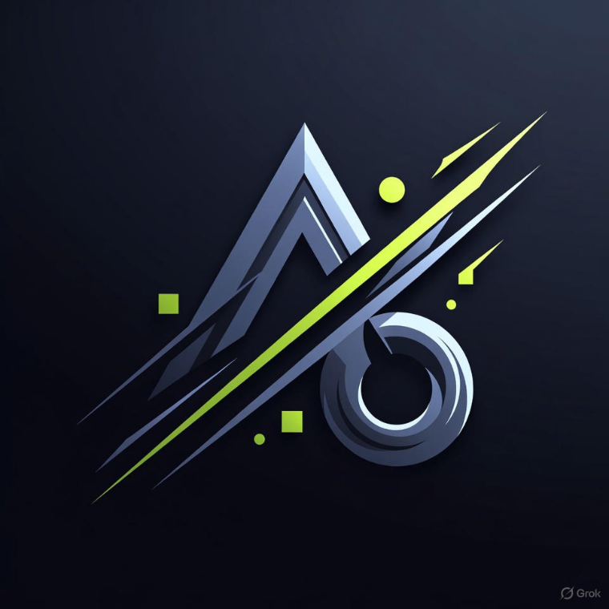

# Victor's Portfolio

A modern, responsive portfolio website showcasing my work as a Frontend Developer. Built with React and featuring a sleek dark/light mode toggle, smooth animations, and an intuitive user interface.



## 🌟 Features

- **Responsive Design**: Fully optimized for desktop, tablet, and mobile devices
- **Dark/Light Mode**: Toggle between themes for comfortable viewing
- **Smooth Scrolling**: Seamless navigation between sections
- **Interactive UI**: Engaging animations and hover effects
- **Progress Bar**: Visual indicator of scroll position
- **Portfolio Showcase**: Detailed project cards with live demos and GitHub links
- **Certificates Page**: Dedicated page to display professional certifications
- **Contact Section**: Multiple ways to get in touch with social media integration

## 🚀 Live Demo

[View Live Portfolio](https://portfolio-gamma-eight-24.vercel.app/p)

## 🛠️ Technologies Used

- **Frontend Framework**: React 19.2.0
- **Build Tool**: Vite 7.2.4
- **Routing**: React Router DOM 7.11.0
- **Icons**: Lucide React 0.562.0
- **Styling**: Custom CSS with CSS3 animations
- **Deployment**: Vercel

## 📂 Project Structure

```
portfolio/
├── public/
│   ├── favicon.svg
│   └── favicon.jpg
├── src/
│   ├── assets/
│   │   └── images/
│   │       ├── certificates/
│   │       ├── projects/
│   │       └── profile/
│   ├── components/
│   │   ├── Portfolio.jsx
│   │   ├── Portfolio.css
│   │   ├── Certificates.jsx
│   │   └── Certificates.css
│   ├── App.jsx
│   ├── App.css
│   ├── main.jsx
│   └── index.css
├── index.html
├── package.json
├── vite.config.js
└── README.md
```

## 🎨 Sections

1. **Home**: Welcome section with animated starfield background
2. **Intro**: Brief introduction and professional summary
3. **About**: Detailed background, education, and experience
4. **Skills**: Technical and non-technical skills showcase
5. **Portfolio**: Project cards with descriptions, tech stacks, and links
6. **Contact**: Contact information and social media links
7. **Certificates**: Dedicated page for professional certifications

## 💼 Featured Projects

- **Spotify Clone**: Music player with Spotify API integration
- **LMS Platform**: Learning Management System with authentication
- **Bank AI Assistant**: AI-powered customer service chatbot
- **ShopHub**: E-commerce application with cart functionality
- **Savora Restaurant**: Fine dining restaurant website

## 📦 Installation & Setup

1. **Clone the repository**
   ```bash
   git clone https://github.com/Anyadiegwu/portfolio.git
   cd portfolio
   ```

2. **Install dependencies**
   ```bash
   npm install
   ```

3. **Run development server**
   ```bash
   npm run dev
   ```

4. **Build for production**
   ```bash
   npm run build
   ```

5. **Preview production build**
   ```bash
   npm run preview
   ```

## 🔧 Configuration

### Environment Setup

No environment variables required for basic setup. The portfolio runs entirely on the client side.

### Customization

To customize the portfolio for your own use:

1. Replace images in `src/assets/images/` with your own
2. Update personal information in `Portfolio.jsx`
3. Modify project data in the `projects` array
4. Update skills in the `skills` object
5. Change color schemes in CSS files

## 📱 Responsive Breakpoints

- **Mobile**: < 768px
- **Tablet**: 768px - 1024px
- **Desktop**: > 1024px

## ✨ Key Features Implementation

### Theme Toggle
```javascript
const [isDarkMode, setIsDarkMode] = useState(true);
```

### Smooth Scrolling
```javascript
const scrollToSection = (sectionId) => {
  const element = document.getElementById(sectionId);
  if (element) {
    element.scrollIntoView({ behavior: 'smooth' });
  }
};
```

### Progress Bar
Dynamically updates based on scroll position to show reading progress.

## 🎯 Performance Optimizations

- Lazy loading for images
- Efficient CSS animations with `transform` and `opacity`
- Minimal re-renders with React hooks
- Optimized bundle size with Vite

## 📄 License

This project is open source and available under the [MIT License](LICENSE).

## 🤝 Contact

**Victor Anyadiegwu**

- 📧 Email: victoranyadiegwu610@gmail.com
- 📱 Phone: (+234) 8102680872
- 💼 LinkedIn: [Victor Anyadiegwu](https://www.linkedin.com/in/victor-anyadiegwu-8286a9238)
- 🐙 GitHub: [@Anyadiegwu](https://github.com/Anyadiegwu)
- 📷 Instagram: [@veek__thor](https://www.instagram.com/veek__thor)
- 🐦 Twitter: [@iam_veek_thor](http://www.twitter.com/iam_veek_thor)

## 🙏 Acknowledgments

- **Brekete Code Camp** - Foundation in frontend development
- **Genesys Tech Hub** - Product development internship experience
- **TECHPATRIATE & Brekete Family** - Early learning support

---

⭐ **Star this repository if you found it helpful!**

Made with ❤️ by Victor Anyadiegwu